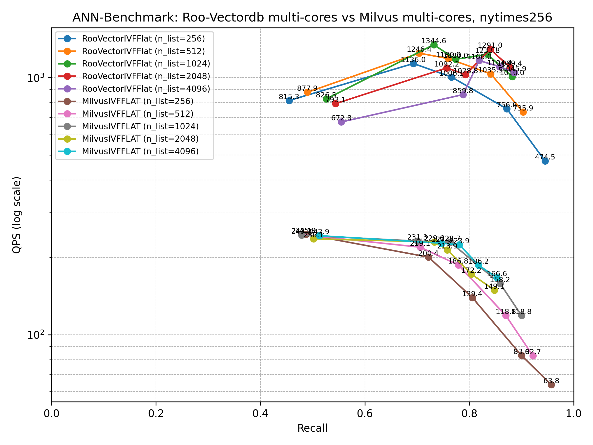
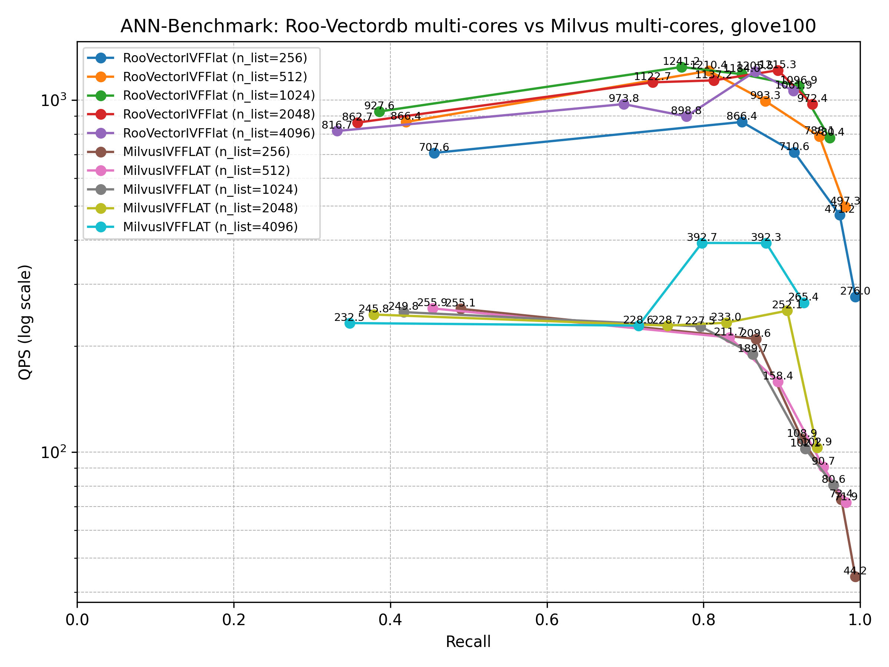
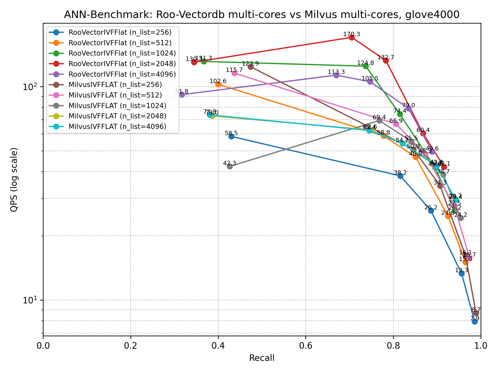
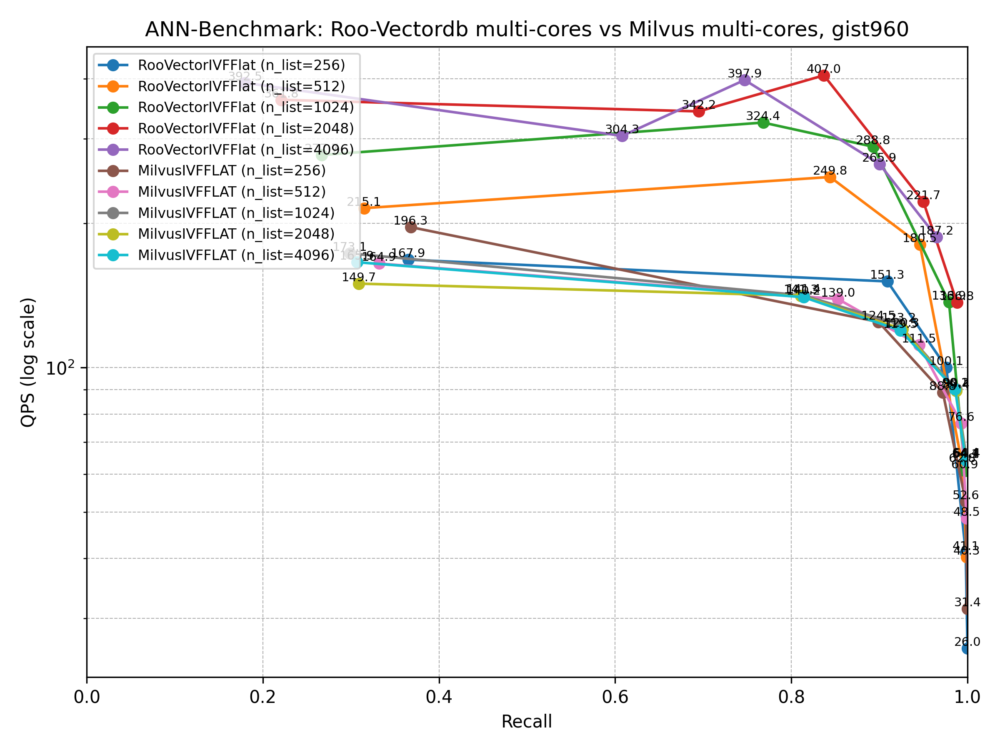
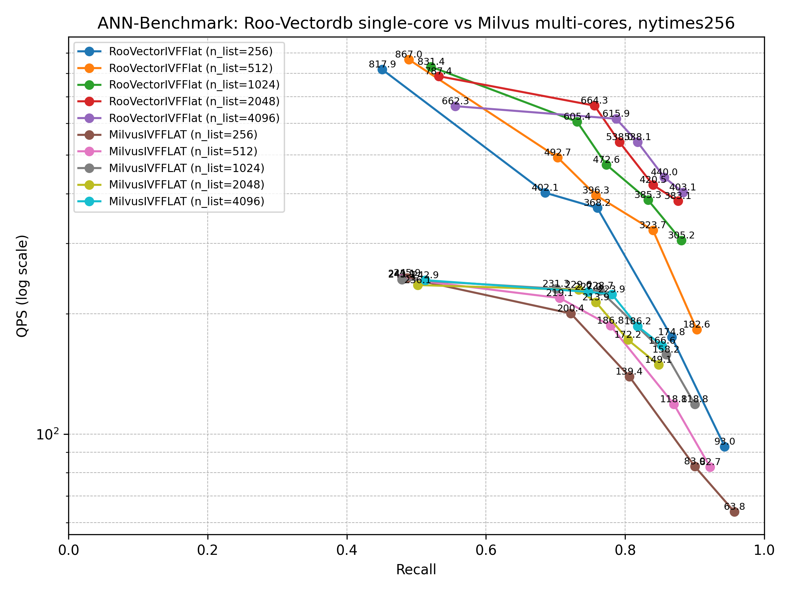
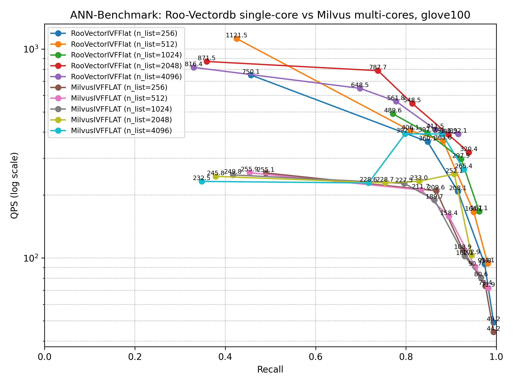
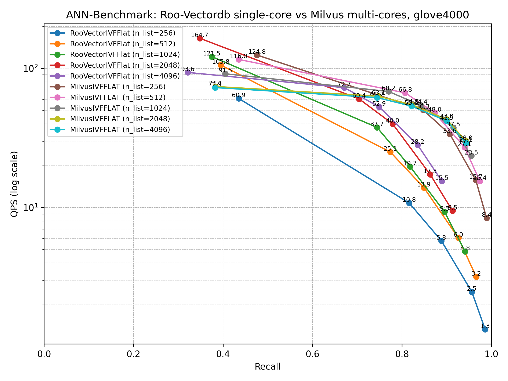
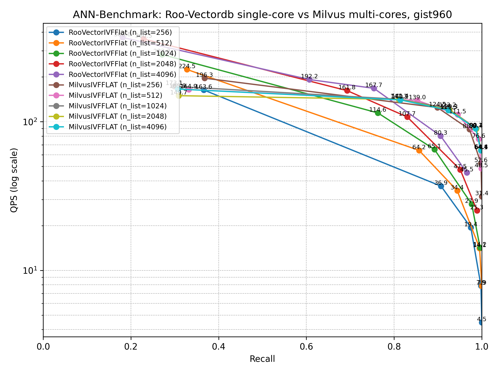

# Roo-VectorDB


**Roo-VectorDB** is a powerful vector database built as an extension on top of PostgreSQL. It seamlessly integrates traditional relational database features with advanced vector search capabilities, making it ideal for a variety of use cases:
* Combines the robustness of relational databases with high-performance vector search to enable fast and efficient retrieval of full-text and image data. Designed for scalability, Roo-VectorDB can handle millions of queries, making it suitable for large-scale web services.
* It excels in multi-agent environments by supporting coordination between agents, serving as a context database tailored for AI agents, facilitating efficient storage, retrieval, and sharing of contextual information. By acting as an intermediate state store, Roo-VectorDB enables AI agents to preserve and exchange contextual data effectively throughout their interactions.

Roo-VectorDB is a component of the Roo-Agent Toolkit and is distributed under the Apache 2.0 License.


## Highlights

* **High-Dimensional Vector Support**: Supports vectors with up to 16,000 dimensions of two data types: *roovector* (Float32) and *roohalfvector* (Float16).
* **Metadata Filtering Support**: Utilizes native SQL `WHERE` clauses for filtering, with query planner optimizations to ensure high-performance search.
* **Approximate Nearest Neighbor Search**: Implements the IVF-Flat indexing method to support high-dimensional vectors (up to 16,000) for index creation.
* **Optimized Vector Distance Computation**:
  * SIMD acceleration for vector-to-vector operations
  * OpenBLAS integration for fast vector-to-matrix operations
* **Real-time Index Synchronization**: Ensures "zero-latency" between data updates and index queries. Index updates occur instantly upon table modification, enabling immediate querying by all users across connections.
* **Memory Management**:
  * Shared memory architecture with a shared state for efficient, timestamp-aware data access and management.
  * Efficient memory access through optimized vectors loading and sharing strategies.
* **Configurable Multi-threaded Query Execution**: Allows user-configurable thread counts in parallel processing.
* **GPU Support**: GPU acceleration will be available exclusively to commercial license holders.

## Performance

We benchmarked performance under two scenarios: single-core and multi-core execution, using a controlled Docker environment. Tests were run on a high-performance server featuring an Intel® Xeon® Gold 6212U CPU (up to 3.9 GHz) with 24 cores and 48 threads, 512 GB of RAM, and over 500 GB of available storage.

To evaluate query performance, we benchmarked the system using the IVF-Flat indexing method. This method is controlled by two parameters: `nlists` (number of clusters) and `nprobes` (number of clusters searched during query time). For our tests, we varied `nlists` across {256, 512, 1024, 2048, 4096} and `nprobes` across {1, 10, 20, 50, 100}, resulting in 25 distinct parameter combinations per dataset.

We selected four standard benchmark datasets from the [ANN-benchmarks](https://github.com/erikbern/ann-benchmarks/?tab=readme-ov-file#data-sets) suite, covering two different distance metrics to ensure comprehensive evaluation across diverse use cases.

| *Dataset Name* | *Dimension* | *Size* | *Distance Metric* |
|----------------| ------------|--------|-------------------|
| glove-100-angular    | 100  | 1,183,514 | Cosine |
| nytimes-256-angular  | 256  | 290,000   | Cosine |
| gist-960-euclidean   | 960  | 1,000,000 | L2     |
| *glove-4000-angular* | 4000 | 1,183,514 | Cosine |

**Note**: `glove-4000` is a synthetic dataset derived by repeating each 200-dimensional vector from `glove-200` twenty times. It is primarily used for testing query performance on high-dimensional vectors.

### Multi-core performance

In this test, each algorithm is allowed to utilize all available CPU cores—48 in our test environment—for maximum throughput. 

To optimize resource usage, parallel execution is disabled when `nprobes = 1`, as the computational load is minimal in this case. However, this setup may introduce slight overhead, resulting in a small performance drop in low-recall scenarios (`nprobes = 1`) compared to high-recall configurations (`nprobes > 1`).

#### Multi-core nytimes 256-dimension

<center></center>

#### Multi-core glove 100-dimension

<center></center>

#### Multi-core glove 4000-dimension

<center></center>

#### Multi-core gist 960-dimension

<center></center>

### Single-core performance

For consistency and fair comparison, each algorithm in this benchmark was restricted to a single CPU core during testing.

#### Single-core nytimes 256-dimension

<center></center>

#### Single-core glove 100-dimension

<center></center>

#### Single-core glove 4000-dimension

<center></center>

#### Single-core gist 960-dimension

<center></center>

We observed a significant performance gain—ranging from 50% to 300%—when using multi-core execution compared to single-core, particularly for high-dimensional data. This improvement reflects our optimizations in handling high-throughput vector processing. For low-dimensional data, we believe there is still room to enhance I/O throughput.

## Tutorials

We provide tutorials covering popular use cases such as full-text search, image search, and long-document retrieval. Please refer to the `README` file in the `tutorial` folder for step-by-step instructions.

* [Full Text Search](tutorials/README.md#full-text-search)
* [Images Search](tutorials/README.md#image-search)
* [Long Document Search](tutorials/README.md#long-document-search)

## Installation

Our current version only supports Postgres 16 or higher.

### Linux (Ubuntu) Package

The current installation is provided as a Debian (.deb) package, supported on Ubuntu and other Debian-based distributions, with support for additional Linux distros coming soon.

**Depends**: postgresql (>= 16), python3 (>= 3.10), python3-venv, python3-pip, libcurl4-openssl-dev

The installed version of Roo-VectorDB does not support cluster mode. For more information or cluster support inquiries, please contact ROOAGI at lw@rooagi.com.


Install dependencies
```bash
sudo apt install  postgresql-16 python3 python3-venv python3-pip libcurl4-openssl-dev
```
Install `roo-vectordb` package
```bash
sudo apt install ./roo-vectordb_0.1-0_amd64.deb
```

### Install with Docker

We provide a `docker-compose.yaml`, `Dockerfile`, and `entrypoint.sh` to help you get started quickly.
To build the Docker image, make a new directory `debian` in the same directory as these three files, and place the downloaded package `roo-vectordb_0.1-0_amd64.deb` in the `debian` folder.
Run `chmod +x entrypoint.sh` to change permission of `entrypoint.sh`, to ensure `entrypoint.sh` is executable.

You can customize the Docker image by editing the three Docker-related files as needed.
By default, the `docker-compose` setup will launch a container with the `roo-vectordb` package pre-installed. It maps host port 58432 to the container’s PostgreSQL port 8432.

#### Docker Image Build

In the directory containing all four files (`docker-compose.yaml`, `Dockerfile`, `entrypoint.sh`, and `roo-vectordb_0.1-0_amd64.deb`), you can build the Docker image by running:
```bash 
docker build -t roo-vectordb:latest --platform linux/amd64 --no-cache .
```
If there's firewall in your IT infrastructure, try adding `--network=host` option to the docker build command.

#### Start Container

After the image was built, the image with tag `roo-vectordb:latest` will be avaialbe. Check the built image
```bash
docker images
```
You should see following
```
$ docker images
REPOSITORY                             TAG                            IMAGE ID       CREATED         SIZE
roo-vectordb                           latest                         d9f64a39a9a2   2 minutes ago   1.09GB
```

Start a docker container using `docker compose` command:
```bash
docker compose up -d
```

A default user ("ann") and database ("ann") have been preconfigured in the container, so you can connect directly with:
```bash
psql -U ann -d ann -h localhost -p 58432
```
(The password is also "ann".)

### Suggested Configuration

To achieve the best performance, we suggest to change following configuration items:
```bash
psql -U postgres -c "ALTER USER <USERNAME> SET maintenance_work_mem = '4GB'"
psql -U postgres -c "ALTER SYSTEM SET shared_buffers = '4GB'"
```


## Usage

Once Roo-VectorDB is installed, you can connect using any PostgreSQL-compatible client—for example, psql:
```
psql -U <USERNAME> -d <DBNAME>
```

### Enable Extension

First, enable the extension (do this once in each database where you want to use it):

```tsql
CREATE EXTENSION roovectorcpu;
```

Verify extension has been enable:
```sql
postgres=>\dx
                                          List of installed extensions
     Name     | Version |   Schema   |                                Description                                
--------------+---------+------------+---------------------------------------------------------------------------
 roovectorcpu | 0.1.0   | public     | roo-vectordb is a context database extension running on top of postgresql
```


### Basic Operations

After extension was enabled, two new data types are available: `roovector`, `roohalfvec`. You can do some basic operations:

```sql
--- Create a roovector column with 3 dimensions:
CREATE TABLE items (
  id bigserial PRIMARY KEY, 
  embedding roovector(3)
);

-- Insert some vectors to this column:
INSERT INTO items (embedding) VALUES ('[1,2,3]'), ('[4,5,6]');

-- Query for the 5 nearest neighbors by L2 distance:
SELECT * FROM items ORDER BY embedding <-> '[3,1,2]' LIMIT 5;
```

Currently supports following distance metrics:

- Negative inner product (`<#>`), 
- L2 distance (`<->`)
- L1 distance (`<+>`)
- cosine distance (`<=>`)


### Indexing

Without index, Roo-VectorDB can still perform exact nearest neighbor search, which provides perfect recall but relatively slow.

You can add an index to use approximate nearest neighbor (ANN) search, which trades some recall for speed. Unlike typical indexes, you will see different results for queries after adding an approximate index.

Supported index types are:

- [IVFFlat](#ivfflat)


#### IVFFlat

An IVFFlat (Inverted File Flat) index divides vectors into lists, and then searches a subset of those lists that are closest to the query vector.

To achieve high recall, keep the following best practices in mind:

1. Create the index after inserting data into the table to ensure optimal clustering.
2. Choose an appropriate number of lists: use `n_rows / 1000` for datasets up to 1 million rows, and `sqrt(n_rows)` for datasets larger than 1 millsion rows.
3. Set a suitable number of [probes](#query-options) when querying: higher values improve recall, while lower values improve speed. A good starting point is `sqrt(lists)`.


<!--Add an index for each distance function you want to use. -->

To create a IVF-Flat index on a `roovector` type column with 10 lists and different distane metrics:
```sql
-- L2 distance: 
CREATE INDEX my_rooindex ON items USING roo_ivfflat (embedding roovector_l2_ops) WITH (lists = 10);

-- Inner product distance:
CREATE INDEX my_rooindex ON items USING roo_ivfflat (embedding roovector_ip_ops) WITH (lists = 10);

-- Cosine distance:
CREATE INDEX my_rooindex ON items USING roo_ivfflat (embedding roovector_cosine_ops) WITH (lists = 10);
```

Replace `roohalfvec_*_ops` to any `roovector_*_ops` for a `roohalfvec` column on corresponding distance metric.


Current supported data types are:

- `roovector` - up to 16,000 dimensions
- `roohalfvec` - up to 16,000 dimensions

##### Query Options

**roo_ivfflat.probes** (integer): Specify the number of probes (1 by default)

```sql
-- Set probe list number to 10:
SET roo_ivfflat.probes = 10;
```

A higher value provides better recall at the cost of speed, and it can be set to the number of lists for exact nearest neighbor search (at which point the planner won’t use the index)

**roo_ivfflat.iterative_scan** (enum): Turn on or off the iterative scan. Possible values: {`off`, `relaxed_order`}
One problem of using IVFFlat indexing is when `probes` is much smaller than `lists`, or when user is using fitlering with `WHERE` clause, the raw search results that IVFFlat algorithm may be less than what actually needed, and leads to missing results. For example, index is built on a column with 100 rows, where lists = 50 and probes = 1, a raw IVF search might just return 2 to 10 results, but user is querying with `LIMIT 100` which asking for at most 100.

To deal with this case, Roo-VectorDB allows scanner to search iteratively. By setting this option value `relaxed_order`, when the first search result is no enough, the searcher will start next iteration of search and fullfill the result buffer, until the planner does not request results anymore.

```sql
-- Turn on iterative search mode:
SET roo_ivfflat.iterative_scan = relaxed_order;
```

**roo_ivfflat.scan_max_threads_num** (integer): Sepcify the number of threads to use during query (0 by default, means using all avaliable threads).

```sql
-- only use 4 threads for query:
SET roo_ivfflat.scan_max_threads_num = 4;

-- use all available threads:
SET roo_ivfflat.scan_max_threads_num = 0;
```

### Meta Data Filtering

The most straight-forward way of doing meta data filtering is to run an index nearest neighbor queries with a `WHERE` clause. For example:

```sql
-- fitler with "=" on `id` column
SELECT * FROM items WHERE id = 123 ORDER BY embedding <-> '[3,1,2]' LIMIT 5;

-- fitler with "<" on `embedding` column itself
SELECT * FROM items WHERE (embedding <=> '[4,6,5]' < 2.5) ORDER BY embedding <-> '[3,1,2]' LIMIT 5;
```

## Copy Data from pgvector

Roo-VectorDB is fully compatible with pgvector. If you already have a table using a pgvector column, there's no need to start from scratch. You can follow the steps below to copy the existing pgvector column data into a new Roo-VectorDB column.

Assume the orinigal table schema is like this:
```
                    Table "public.items"
  Column   |      Type      | Collation | Nullable | Default 
-----------+----------------+-----------+----------+---------
 id        | integer        |           |          | 
 embedding | vector(100)    |           |          | 
```

* Step 1: Create a new column with type `real[]`:
```sql
-- Say the new column name is `embed2`
ALTER TABLE items ADD COLUMN embed2 real[];
```

* Step 2: Copy the pgvector data column to this new column:
```sql
UPDATE items SET embed2 = embedding;
```

* Step 3: Convert the new column  from `real[]` to `roovector`
```sql
ALTER TABLE items ALTER COLUMN embed2 TYPE roovector(100);
```

After all 3 steps, now the table schema should look like:
```
                    Table "public.items"
  Column   |      Type      | Collation | Nullable | Default 
-----------+----------------+-----------+----------+---------
 id        | integer        |           |          | 
 embedding | vector(100)    |           |          | 
 embed2    | roovector(100) |           |          | 
```

You can following the similar steps by converting a `halfvec` column of pgvector to `roohalfvec` column of Roo-VectorDB.

### Service

Roo-VectorDB services: *roo-vectordb.service*

This service enables diagnostic log collection, which is sent to telemetry.rooagi.com:4138 to help improve stability and performance.


## Commercial License

You can start building with ROOAGI right away using the Evaluation License, which supports up to 50,000 vectors per table. When your project grows, simply upgrade to a commercial license to unlock full scalability and advanced features.

For more information or to request a commercial license, visit [rooagi.com](https://rooagi.com/).


## Thanks

This project is inspired by [pgvector](https://github.com/pgvector/pgvector/tree/v0.8.0) and other open-source vector databases. Contributions and feedback are welcome and encouraged.
